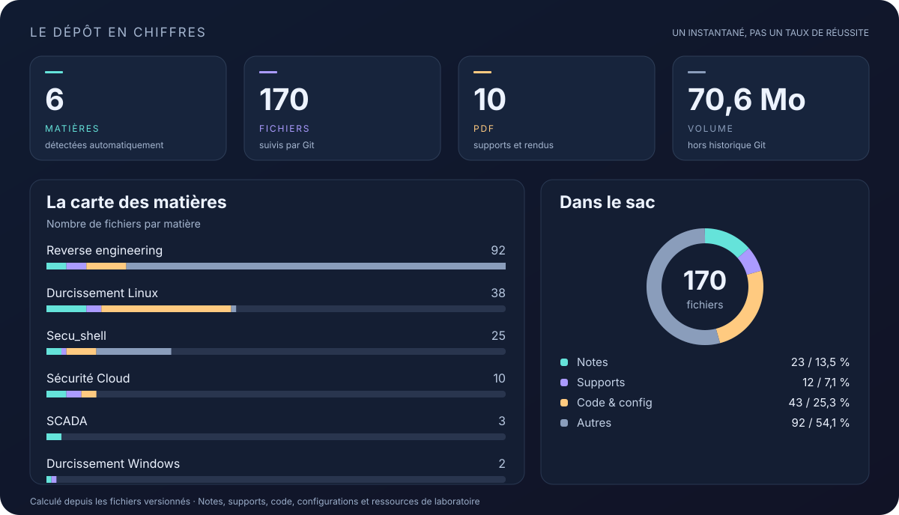

  <strong>Mes cours d'ing3</strong> 

  <a href="#les-matières">📚 Explorer les matières</a> ·
  <a href="#le-dépôt-en-chiffres">📊 Voir les chiffres</a> ·
  <a href="#un-carnet-qui-grandit">🌱 Suivre la suite</a>

> **Année en cours.** Ce dépôt évolue au fil des séances : nouvelles matières, exercices, rendus et corrections. Il reflète mon travail à un instant donné, avec ses essais et ses pistes à approfondir.

<!-- AUTO:START -->

## Le dépôt en chiffres

**6 matières** · **175 fichiers** · **70,7 Mo versionnés**

Les barres montrent le volume de fichiers, pas l’avancement des cours. Les archives et données de laboratoire comptent aussi.

## Les matières

Chaque matière a son espace. Le lien **Ouvrir** mène au document d’entrée lorsqu’il existe, sinon au dossier.

| Matière | Notes | Supports | Code & config | Autres | Volume | Entrée |
| :-- | --: | --: | --: | --: | --: | :-- |
| **[Durcissement Linux](./Durcissement%20Linux/)** Debian, audits, confinement et automatisation du durcissement. | 8 | 3 | 26 | 1 | 3,5 Mo | [Ouvrir ↗](./Durcissement%20Linux/README.md) |
| **[Durcissement Windows](./Durcissement%20Windows/)** Sécurité du système, identités et mécanismes de protection. | 1 | 1 | 0 | 0 | 741,0 Ko | [Ouvrir ↗](./Durcissement%20Windows/TP2.md) |
| **[Reverse engineering](./Revserse/)** Analyse de binaires, désassemblage, débogage et comptes rendus. | 4 | 4 | 8 | 72 | 64,0 Mo | [Ouvrir ↗](./Revserse/Reverse%20engineering.pdf) |
| **[SCADA](./SCADA/)** Systèmes industriels, réseaux et notes de séances. | 3 | 0 | 0 | 0 | 16,3 Ko | [Ouvrir ↗](./SCADA/Seance1) |
| **[Secu\_shell](./Secu_shell/)** Notes, exercices et ressources de la matière. | 4 | 1 | 7 | 22 | 1,8 Mo | [Ouvrir ↗](./Secu_shell/) |
| **[Sécurité Cloud](./S%C3%A9curit%C3%A9%20Cloud/)** IAM, analyse de politiques et travaux pratiques cloud. | 4 | 3 | 3 | 0 | 681,6 Ko | [Ouvrir ↗](./S%C3%A9curit%C3%A9%20Cloud/rendu1.md) |
| **Total** | **24** | **12** | **44** | **95** | **70,7 Mo** | |

Notes : Markdown, texte et formats similaires. Supports : PDF, documents et présentations. Code & config : scripts, sources et paramètres. Autres : archives, binaires, images et fichiers de projet.

<!-- AUTO:END -->

## Un carnet qui grandit

**Comprendre → tester → documenter → revenir dessus.**

Je rassemble ici mes notes, les supports de cours, les exercices et les traces de mes manipulations. Chaque matière garde sa propre organisation : un README lorsqu’il existe, des séances, des scripts ou des rendus selon le besoin.

De nouveaux dossiers viendront compléter l’année. Le catalogue et les graphiques les intégreront automatiquement dès que leurs premiers fichiers seront ajoutés à Git et poussés sur la branche par défaut.

<strong>⚙️ Comment ce README se met à jour</strong>

Le README reste une page Markdown avec des images SVG locales, lisible directement sur GitHub. Un petit script Python recalcule les chiffres et le catalogue ; GitHub Actions enregistre les changements après chaque push sur la branche par défaut. Aucun service de statistiques externe ni token personnel n’est nécessaire.

- **Nouvelle matière :** ajouter un dossier à la racine avec au moins un fichier suivi par Git. Le nom du dossier devient automatiquement son nom dans le catalogue.
- **Personnalisation facultative :** ajuster un titre, une description ou un lien d’entrée dans [la configuration](.github/readme-config.json). Les nouvelles matières fonctionnent aussi sans configuration.
- **Texte personnel :** tout ce qui se trouve en dehors des marqueurs `AUTO:START` et `AUTO:END` reste librement modifiable. Les visuels et le bloc entre ces marqueurs sont générés.
- **Actualisation locale :** après avoir ajouté les fichiers concernés à l’index avec `git add`, lancer `python .github/scripts/update_readme.py` depuis la racine (Python 3.10+ ; sous Windows, `py -3` convient aussi). Ajouter ensuite les fichiers générés au commit.
- **Actualisation manuelle sur GitHub :** onglet **Actions → Actualiser le README → Run workflow** sur la branche par défaut.

Les calculs utilisent les fichiers ordinaires non cachés présents dans l’index Git : les fichiers non suivis, liens symboliques, sous-modules, dossiers vides et fichiers propres au tableau de bord sont exclus. Les exclusions de dossiers sont personnalisables dans la configuration. Les tailles sont celles des fichiers versionnés, hors historique Git et hors contenu décompressé des archives. Les catégories reposent sur les extensions et quelques conventions de nommage ; les fichiers de laboratoire, bases Ghidra et archives sont inclus dans « Autres ».

L’automatisation a besoin que GitHub Actions soit autorisé et que les règles de la branche permettent au jeton `GITHUB_TOKEN` d’écrire. Le workflow demande uniquement `contents: write`. S’il ne peut pas publier, les visuels restent consultables et peuvent être régénérés localement. Après un commit automatique, faire un `git pull` avant de poursuivre les prochains changements locaux.

Code : [générateur](.github/scripts/update_readme.py) · [workflow](.github/workflows/readme.yml) · [tests](.github/scripts/test_update_readme.py).

---

Un semestre à la fois. Une séance après l’autre. Toujours quelque chose à apprendre.

